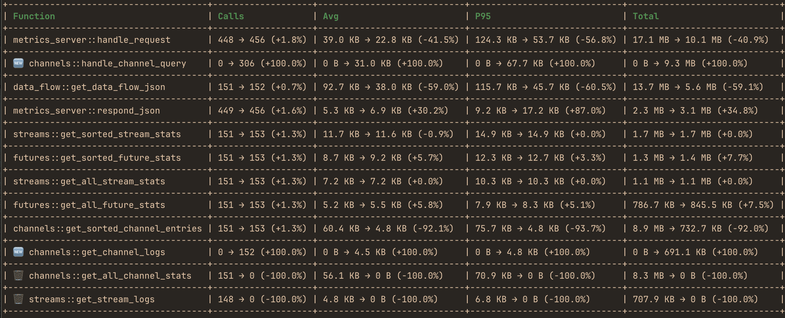

#  hotpath - real-time Rust performance, memory and data flow profiler
[](https://crates.io/crates/hotpath) [](https://github.com/pawurb/hotpath/actions)

hotpath-rs is an easy-to-configure Rust performance profiler that shows exactly where your code spends time and allocates. Instrument functions, channels, futures, and streams to quickly find bottlenecks and focus optimizations where they matter most. Get actionable insights into time, memory, and async data flow with minimal setup.

Try the TUI demo via SSH - no installation required:

```
ssh demo.hotpath.rs
```

Explore the full documentation at [hotpath.rs](https://hotpath.rs). See [CONTRIBUTING.md](CONTRIBUTING.md) for development setup and guidelines.

You can use it to produce one-off performance (timing or memory) reports:


compare performance between different app versions:



or use the live TUI dashboard to monitor real-time performance metrics with debug info:

https://github.com/user-attachments/assets/2e890417-2b43-4b1b-8657-a5ef3b458153

## Features

- **Zero-cost when disabled** - fully gated by a feature flag.
- **Low-overhead** time/memory profiling for both sync and async code.
- **Live TUI dashboard** - real-time monitoring of performance data flow metrics in TUI dashboard (built with [ratatui.rs](https://ratatui.rs/)).
- **Static reports for one-off programs** - alternatively print profiling summaries without running the TUI.
- **Memory allocation tracking** - track bytes allocated and allocation counts per function.
- **Channel and stream monitoring** - instrument channels and streams to track message flow and throughput.
- **Futures instrumentation** - monitor any async piece of code to track poll counts, lifecycle and resolved values.
- **Detailed stats**: avg, total time, call count, % of total runtime, and configurable percentiles (p95, p99, etc.).
- **Tokio runtime monitoring** - track worker thread utilization, task scheduling, and queue depths.
- **MCP server for AI agents** - built-in [Model Context Protocol](https://modelcontextprotocol.io/) server that lets LLMs query profiling data in real-time.
- **GitHub Actions integration** - configure CI to automatically benchmark your program against a base branch for each PR.

## Getting Started

### Installation

Add to your `Cargo.toml`:

```toml
[dependencies]
hotpath = "0.15"

[features]
hotpath = ["hotpath/hotpath"]
hotpath-alloc = ["hotpath/hotpath-alloc"]
```

This config ensures that the lib has no compile time or runtime overhead unless explicitly enabled via a `hotpath` feature. All the lib dependencies are optional (i.e. not compiled) and all macros are noop unless profiling is enabled.

### Basic setup

You'll need only `#[hotpath::main]` and `#[hotpath::measure]` macros to get started:

```rust
#[hotpath::measure]
fn sync_function(sleep: u64) {
    std::thread::sleep(Duration::from_nanos(sleep));
    let vec1 = vec![1, 2, 3];
    std::hint::black_box(&vec1); // force mem allocation
}

#[hotpath::measure]
async fn async_function(sleep: u64) {
    tokio::time::sleep(Duration::from_nanos(sleep)).await;
}

// When using with tokio, place the #[tokio::main] first
#[tokio::main]
#[hotpath::main]
async fn main() {
    for i in 0..10000 {
        sync_function(i);
        async_function(i * 2).await;

        hotpath::measure_block!("custom_block", {
            std::thread::sleep(Duration::from_nanos(i * 3))
        });
    }
}
```

Now, run your program with `hotpath` (and optionally `hotpath-alloc` features):

```bash
cargo run --features='hotpath,hotpath-alloc'
```

On exit it will print a report with timings, memory allocations and thread usage metrics:

```
[hotpath] 1.20s | timing, alloc, threads

timing - Function execution time metrics.
+------------------------------+-------+----------+----------+----------+---------+
| Function                     | Calls | Avg      | P95      | Total    | % Total |
+------------------------------+-------+----------+----------+----------+---------+
| docs_example::main           | 1     | 1.20 s   | 1.20 s   | 1.20 s   | 100.00% |
+------------------------------+-------+----------+----------+----------+---------+
| docs_example::async_function | 1000  | 1.15 ms  | 1.20 ms  | 1.15 s   | 96.10%  |
+------------------------------+-------+----------+----------+----------+---------+
| custom_block                 | 1000  | 18.13 µs | 31.71 µs | 18.13 ms | 1.51%   |
+------------------------------+-------+----------+----------+----------+---------+
| docs_example::sync_function  | 1000  | 16.58 µs | 27.63 µs | 16.58 ms | 1.38%   |
+------------------------------+-------+----------+----------+----------+---------+

alloc - Cumulative allocations during each function call (including nested calls).
+------------------------------+-------+---------+---------+---------+---------+
| Function                     | Calls | Avg     | P95     | Total   | % Total |
+------------------------------+-------+---------+---------+---------+---------+
| docs_example::main           | 1     | 63.0 KB | 63.1 KB | 63.0 KB | 100.00% |
+------------------------------+-------+---------+---------+---------+---------+
| docs_example::sync_function  | 1000  | 12 B    | 12 B    | 11.7 KB | 18.58%  |
+------------------------------+-------+---------+---------+---------+---------+
| custom_block                 | 1000  | 0 B     | 0 B     | 0 B     | 0.00%   |
+------------------------------+-------+---------+---------+---------+---------+
| docs_example::async_function | 1000  | 0 B     | 0 B     | 0 B     | 0.00%   |
+------------------------------+-------+---------+---------+---------+---------+

threads - Thread CPU and memory statistics. (RSS: 7.8 MB, Alloc: 2.1 MB, Dealloc: 304.3 KB, Diff: 1.8 MB, 5/10)
+--------------+----------+------+------+----------+---------+-----------+----------+----------+----------+
| Thread       | Status   | CPU% | Max% | CPU User | CPU Sys | CPU Total | Alloc    | Dealloc  | Diff     |
+--------------+----------+------+------+----------+---------+-----------+----------+----------+----------+
| hp-functions | Sleeping | 1.8% | 1.8% | 0.018s   | 0.001s  | 0.019s    | 1.8 MB   | 291.3 KB | 1.5 MB   |
+--------------+----------+------+------+----------+---------+-----------+----------+----------+----------+
| main         | Sleeping | 6.3% | 6.3% | 0.123s   | 0.070s  | 0.193s    | 367.8 KB | 9.9 KB   | 357.9 KB |
+--------------+----------+------+------+----------+---------+-----------+----------+----------+----------+
| hp-threads   | Running  | 0.0% | 0.0% | 0.000s   | 0.001s  | 0.001s    | 10.3 KB  | 3.0 KB   | 7.3 KB   |
+--------------+----------+------+------+----------+---------+-----------+----------+----------+----------+
| hp-server    | Sleeping | 0.0% | 0.0% | 0.000s   | 0.001s  | 0.001s    | 1.8 KB   | 56 B     | 1.7 KB   |
+--------------+----------+------+------+----------+---------+-----------+----------+----------+----------+
| thread_5     | Sleeping | -    | -    | 0.000s   | 0.000s  | 0.000s    | 640 B    | 24 B     | 616 B    |
+--------------+----------+------+------+----------+---------+-----------+----------+----------+----------+
```

## Full documentation

See the full docs and advanced config tutorials at [hotpath.rs](https://hotpath.rs).

- [Sampling Comparison](https://hotpath.rs/sampling_comparison) - when to use `hotpath` vs CPU sampling profilers
- [Profiling modes](https://hotpath.rs/profiling_modes) - static reports vs live TUI dashboard
- [Functions](https://hotpath.rs/functions) - measure execution time and memory allocations
- [A/B Benchmarks](https://hotpath.rs/benchmarks) - compare performance between app versions
- [Async Data Flow](https://hotpath.rs/data_flow) - monitor channels, streams, and futures
- [Debug & Metrics](https://hotpath.rs/debug) - track custom values with `dbg!`, `val!`, and `gauge!` macros
- [Threads](https://hotpath.rs/threads) - monitor threads usage
- [Tokio Runtime](https://hotpath.rs/tokio_runtime) - monitor Tokio runtime worker stats and task scheduling
- [MCP Server](https://hotpath.rs/mcp) - LLM integration via Model Context Protocol
- [GitHub CI](https://hotpath.rs/github_ci) - automated benchmarking and regression detection in CI
- [Configuration](https://hotpath.rs/configuration) - explore all config options

## Status

This project is under active development. Core public APIs are stable, but implementation details (JSON report formats, TUI/MCP internals, and advanced config options) may change between releases as the project evolves.
