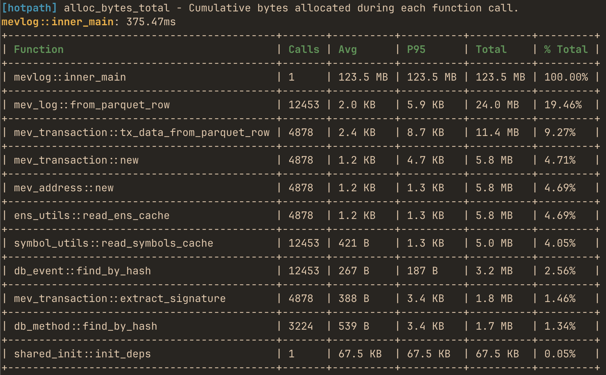

# Real-time Rust performance, memory and data flow profiler

<div class="hero-row">
  
  <div class="ssh-demo-container">
    <p class="ssh-demo-label">Try the TUI demo via SSH - no installation required:</p>
    <div class="terminal-shell">
      <span class="terminal-prompt">$</span>
      <span class="terminal-command">ssh demo.hotpath.rs</span>
    </div>
  </div>
</div>

[hotpath-rs](https://github.com/pawurb/hotpath-rs) is a simple async Rust profiler. It instruments functions, channels, futures, and streams to quickly find bottlenecks and focus optimizations where they matter most. `hotpath` can provide actionable insights into time, memory, and data flow with minimal setup.
<div style="clear: both;"></div>

You can use it to produce one-off performance (timing or memory) reports:



or use the live TUI dashboard to monitor real-time performance and data flow metrics with debug info:

<video width="100%" loop muted playsinline controls>
  <source src="videos/hotpath-live-dashboard.mp4" type="video/mp4">
</video>

## Features

- **Zero-cost when disabled** - fully gated by a feature flag.
- **Low-overhead** profiling for both sync and async code.
- **Live TUI dashboard** - real-time monitoring of performance data flow metrics in TUI dashboard (built with [ratatui.rs](https://ratatui.rs/)).
- **Static reports for one-off programs** - alternatively print profiling summaries without running the TUI.
- **Memory allocation tracking** - track bytes allocated and allocation counts per function.
- **Channels, futures and streams monitoring** - track messages flow and throughput.
- **Detailed stats**: avg, total time, call count, % of total runtime, and configurable percentiles (p95, p99, etc.).
- **GitHub Actions integration** - configure CI to automatically benchmark your program against a base branch for each PR

## Quick demo

Other then the SSH demo an easy way to quickly try the TUI is to run it in **auto-instrumentation mode**. The TUI process profiles itself and displays its own performance metrics in real time.

First, install `hotpath` CLI with auto-instrumentation enabled:

```bash
cargo install hotpath --features='tui,hotpath,hotpath-alloc'
```

Then launch the console:

```bash
hotpath console
```

and you'll see timing, memory and channel usage metrics.

Make sure to reinstall it without the auto-profiling features so that you can also observe metrics of other programs!

```bash
cargo install hotpath --features='tui'
```

## Installation

Add to your `Cargo.toml`:

```toml
[dependencies]
hotpath = "0.9"

[features]
hotpath = ["hotpath/hotpath"]
hotpath-alloc = ["hotpath/hotpath-alloc"]
```

This config ensures that the lib has no compile time or runtime overhead unless explicitly enabled via a `hotpath` feature. All the lib dependencies are optional (i.e. not compiled) and all macros are noop unless profiling is enabled.

## Learn more

See the rest of the docs to learn how to instrument and profile your program:

- [Sampling Comparison](./sampling_comparison.html) - when to use `hotpath` vs CPU sampling profilers
- [Profiling modes](./profiling_modes.html) - static reports vs live TUI dashboard
- [Functions](./functions.html) - measure execution time and memory allocations
- [Futures](./futures.html) - monitor async code, poll counts, and resolved values
- [Channels](./channels.html) - track messages flow and throughput
- [Streams](./streams.html) - instrument async streams
- [Threads](./threads.html) - monitor threads usage
- [MCP Server](./mcp.html) - LLM integration via Model Context Protocol 
